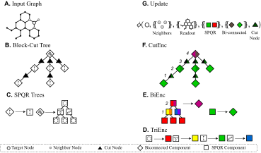

# PlanE: Representation Learning over Planar Graphs
This repository is the official codebase of the NeurIPS 2023 paper "Representation Learning over Planar Graphs"([Arxiv]((https://arxiv.org/abs/2307.01180))). 

The goal of this work is to design architectures for **efficiently** learning **complete** invariants of planar graphs. Inspired by the classical planar graph isomorphism algorithm of Hopcroft and Tarjan, we propose PlanE as a framework for planar representation learning. PlanE includes architectures which can learn **complete** invariants over planar graphs while remaining practically scalable. 



## Getting Started
### Environment
We provide all the dependencies in a conda environment. You can create the environment by running
```bash
conda env create -f environment.yml
```

You may also use [micromamba](https://mamba.readthedocs.io/en/latest/user_guide/micromamba.html) to speed up environment installation.

### Run experiments
Before running the experiments, you will first need to prepare the dataset. Simply run the following command to download and preprocess all datasets used in the paper.

```bash
python3 -m preprocess.prepare
```

We use [WanDB](https://wandb.ai/) to track experiments. You can use our pre-defined searching grid by creating a sweep from the [experiments/config](experiments/config) folder. For example, `wandb sweep experiments/config/express_synth/exp/plane.yaml` will create a WanDB sweep to tune PlanE on the EXP dataset. After creating a sweep, you can find the command to launch the sweep from the command line output. They are usually in the form of `wandb agent <username>/<project>/<sweep_id>`. 

Once the experiment is launched, you can find the result in the WanDB dashboard. The training/validation/test metric is logged as `train`, `valid`, `test`.

## Extra Datasets
We designed two extra synethetic datasets to evaluate the expressitivity of PlanE model. 

### Synthetic Dataset: QM9CC
We designed the QM9CC dataset to evaluate the model's ability to detect structural graph signals *without* an explicit reference to the target structure. The dataset is generated from a subset of graphs from the QM9 dataset and the goal is to predict the clustering coefficient of the graph.

If you may want to benchmark your model on the QM9CC dataset,simply copy [datasets/qm9cc_portable.py](datasets/qm9cc_portable.py) and [.dataset_src](.dataset_src) folder to your project. 

### Synthetic Dataset: P3R
The P3R dataset is made from 9 planar 3-regular graphs of size 10. The training, validation and test set are permutations of the 9 graphs. The goal is to predict a number from 0 to 8, which is the index of the graph from the 9 P3R graphs.

## Cite
If you make use of this code, or its accompanying [paper](https://arxiv.org/abs/2307.01180), please cite this work as follows:
```
@inproceedings{DimitrovZAC23,
  author    = {Radoslav Dimitrov and
               Zeyang Zhao and
               Ralph Abboud and
               {\.I}smail {\.I}lkan Ceylan},
  title     = {PLANE: Representation Learning over Planar Graphs},
  booktitle    = {Proceedings of the Thirty-Fourth Annual Conference on Advances in Neural Information Processing Systems, {NeurIPS}},
  year         = {2023}
}
```